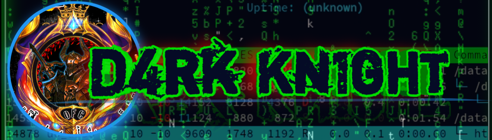
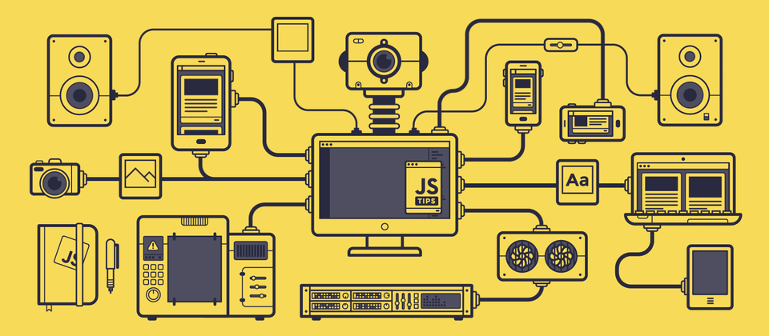

 
  

  

    
  
 

  
  

      
    
  

  

  
    
  

  
</h3>

<h3 align="center">
  

  

  
  
   

<a href="https://api.daily.dev/get?r=U7P4L-IN">

##  A little more about me...  

<l align="center">

</h1>

<!-- Nothing weird to see here -->

  <a href="https://readme.andyruwruw.com/api/now-playing?open">
    <!-- Music bars move to the beat and are colored based on the track's happiness, danceability and energy! -->
    
  </a>

  

 

  <!-- He came up with the idea of HOW to show React components as an img on a README.md and the now playing component! -->

## 🏆 GitHub Trophies
<h3 align="center">

<!-- HacktoberFest Badges -->

     

&nbsp;

  

 <h2><i> Contact With Me :</i></h2>
<h3 align="center">
  
  
  <!--a href="https://youtube.com/user"></! a-->
  <!--a href="https://twitter.com/user"></a -->
  
  <!--a href="https://instagram.com/user"></a-->

## 🐦 Latest Tweet

#### 📊This Week I Spent My Time On:⏰🕜
<h3 align="center">
  

  
 # 💻 Tech Stack:
<h3 align="center">

<table><tr><td valign="top" width="33%">

### Frontend  

  
  
  
  
  
  
  

</td><td valign="top" width="33%">

### Backend  

  
  
  
  
  
  
  

</td><td valign="top" width="33%">

### DevOps  

  
  
  
  
  
  
  

</td></tr></table>  

   

<h2><i> Skills & DevTools Stack :</i></h2>
<h3 align="center">

 

  <kbd>
    <kbd>Front-end</kbd>
     
     
     
     
     
    
  </kbd>
  <kbd>
    <kbd>Back-end</kbd>
     
     
    
    
    
    
  </kbd>
  <kbd>
    <kbd>Library/FrameWorks</kbd>
     
     
    
    
    
    
  </kbd>
   
  <kbd>
    <kbd>Apps</kbd>
     
     
    
    
    
  </kbd>
  <kbd>
    <kbd>Terminal Scripts</kbd>
     
     
    
    
    
  </kbd>
  <kbd>
    <kbd>Tools</kbd>
     
     
    
    
    
  </kbd>
  <kbd>
    <kbd>OS</kbd>
     
     
    
    
    
  </kbd>

 

## 📊 GitHub Stats:
<h3 align="center">

  

   
  
 

 
  
<!-- Proudly created with GPRM ( https://gprm.itsvg.in ) -->

<!-- Contribution Snake -->

<!-- Footer -->

 

  

